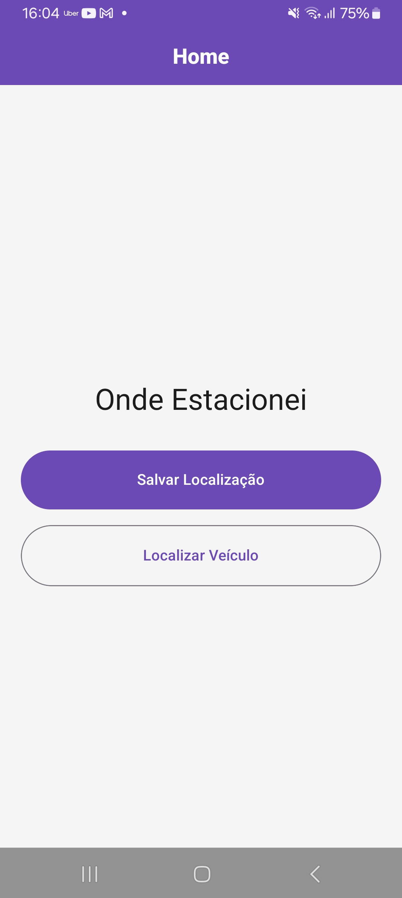
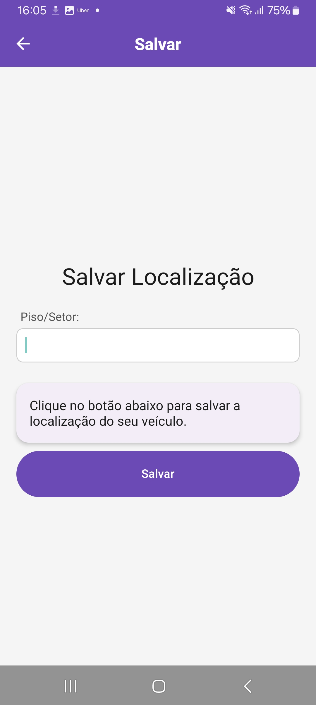
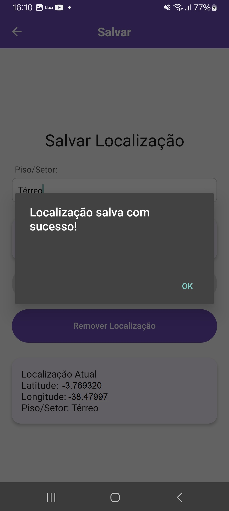
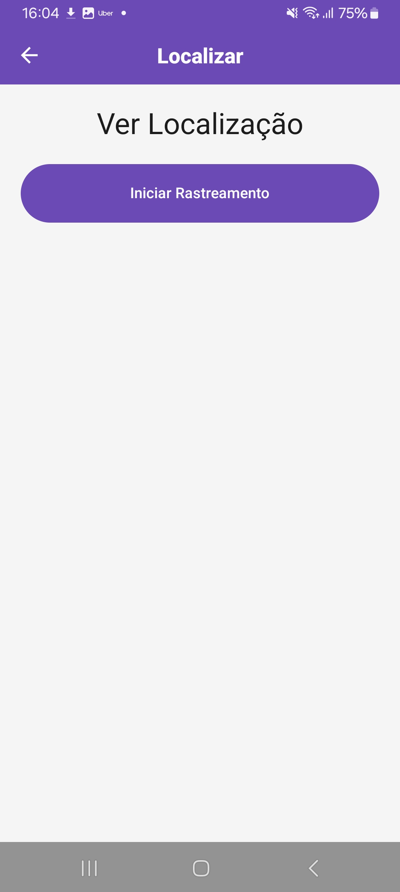
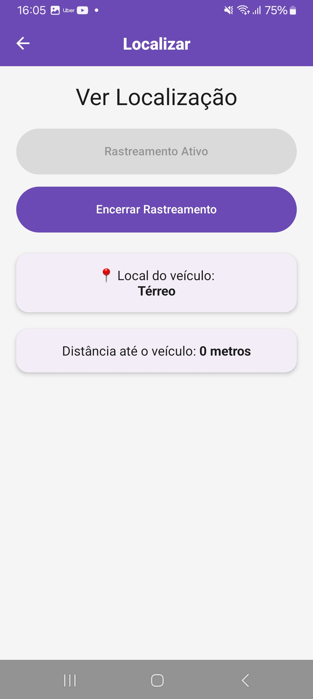
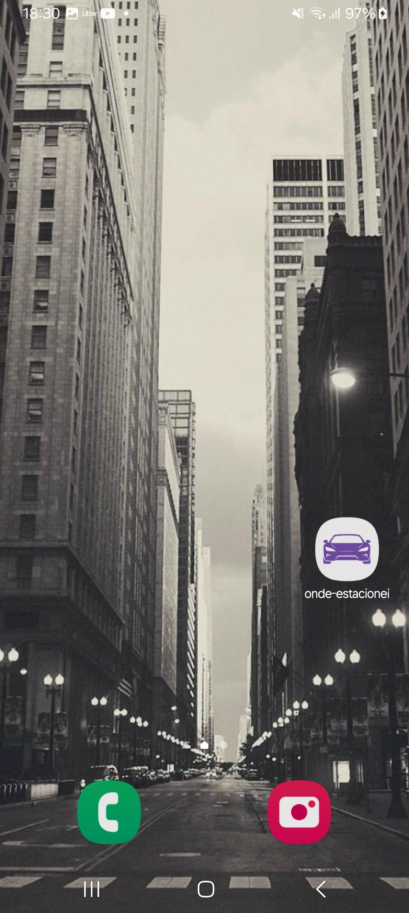

# Onde Estacionei

Aplicativo mobile desenvolvido com React Native (Expo) com o objetivo de ajudar o usuário a salvar a localização do seu veículo e encontrá-lo posteriormente.

## Funcionalidades

```
Salvar localização atual do veículo
Adicionar descrição (ex: piso ou setor)
Rastrear a posição atual do usuário
Calcular distância até o veículo
Remover localização salva
```

## Tecnologias utilizadas

```
React Native (Expo)
JavaScript
React Navigation
React Native Paper
Expo Location
AsyncStorage
```

## Estrutura do Projeto

```
components/ → Componentes reutilizáveis (Botão, Card)
screens/ → Telas do app
hooks/ → Lógica separada (custom hooks)
services/ → Acesso a localização e armazenamento
utils/ → Funções auxiliares (ex: cálculo de distância)
```

## Como executar o projeto

1. Clone o repositório:

```bash
git clone https://github.com/wilkerbezerra/onde-estacionei.git
```

2. Instale as dependências:

```bash
npm install
```

3. Inicie o projeto:

```bash
npx expo start
```

## Observação

O mapa foi desativado pois a API do Google Maps exige cartão de crédito.
O app funciona normalmente apenas com cálculo de distância.

## Objetivo do Projeto

Este projeto foi desenvolvido como parte de um trabalho acadêmico com o objetivo de aplicar, na prática, conceitos de desenvolvimento mobile, utilizando recursos de geolocalização (GPS) e armazenamento local de dados.

A proposta é simular uma solução simples para um problema do dia a dia: lembrar onde o veículo foi estacionado, permitindo salvar a localização e posteriormente calcular a distância até ela.

```
Instituição: UNIFOR – Universidade de Fortaleza
Curso: Análise e Desenvolvimento de Sistemas
Disciplina: N700 – Desenvolvimento de Plataformas Móveis
```

## Demonstração

<p align="center">
  
  
  
</p>

<p align="center">
  
  
  
</p>
